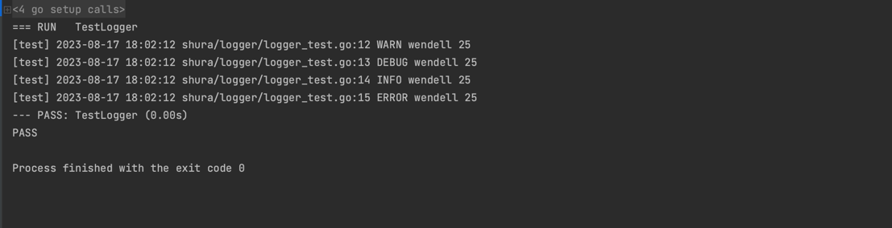

# logger

go语言日志库

# 使用

```shell
go get -u -v github.com/shura/logger
```

# 颜色


# 快速使用

### 带颜色
```go
todo := context.TODO()
logger := Default("test")
logger.Warn(todo, "%s %s", "wendell", "25")
logger.Debug(todo, "%s %s", "wendell", "25")
logger.Info(todo, "%s %s", "wendell", "25")
logger.Error(todo, "%s %s", "wendell", "25")
```

结果


### 关闭颜色
```go
func TestLogger(t *testing.T) {
	todo := context.TODO()
	logger := Default("test")
	logger.DisColor()
	logger.Warn(todo, "%s %s", "wendell", "25")
	logger.Debug(todo, "%s %s", "wendell", "25")
	logger.Info(todo, "%s %s", "wendell", "25")
	logger.Error(todo, "%s %s", "wendell", "25")
}
```



### 设置级别
```go
func TestLoggerLevel(t *testing.T) {
	todo := context.TODO()
	logger := Default("test")
	logger.Level = InfoLevel
	logger.Debug(todo, "%s %s", "wendell", "25")
	logger.Info(todo, "%s %s", "wendell", "25")
	logger.Error(todo, "%s %s", "wendell", "25")
}

=== RUN   TestLoggerLevel
[test] 2023-08-17 17:51:56 shura/logger/logger_test.go:22 INFO wendell 25
[test] 2023-08-17 17:51:56 shura/logger/logger_test.go:23 ERROR  Error Cause by:
wendell 25
--- PASS: TestLoggerLevel (0.00s)
PASS
```


### 自定义格式
```go
func TestValue(t *testing.T) {
	ctx := context.WithValue(context.Background(), "STAFF_ID", "TEST01")
	logger := Default("test")
	logger.SetContentFormat(`{[prefix::yellow]} {time:Y-M-D H:m:s::blue} {[param.STAFF_ID::red]} {line} {level} {msg}`)
	logger.Level = InfoLevel
	logger.Debug(ctx, "%s %s", "wendell", "25")
	logger.Info(ctx, "%s %s", "wendell", "25")
	logger.Error(ctx, "%s %s", "wendell", "25")
}


=== RUN   TestValue
[test] 2023-08-17 17:52:41 [TEST01] shura/logger/logger_test.go:32 INFO wendell 25
[test] 2023-08-17 17:52:41 [TEST01] shura/logger/logger_test.go:33 ERROR  Error Cause by:
wendell 25
--- PASS: TestValue (0.00s)
PASS
```


### 设置输入到文件
```go
func TestLoggerToFile(t *testing.T) {
	todo := context.TODO()
	logger := Default("test")
	logger.SetFilePath("./logger.log")
	logger.ForceColor()
	logger.Debug(todo, "%s %s", "wendell", "25")
	logger.Info(todo, "%s %s", "wendell", "25")
	logger.Error(todo, "%s %s", "wendell", "25")
}
```

### Json格式输出
```go
func TestLoggerJsonFormat(t *testing.T) {
	todo := context.TODO()
	logger := Default("test")
	//logger.SetFilePath("./logger.log")
	logger.SetLogFormat(JsonFormat)
	logger.Debug(todo, "%s %s", "wendell", "25")
	logger.Info(todo, "%s %s", "wendell", "25")
	logger.Error(todo, "%s %s", "wendell", "25")
}


=== RUN   TestLoggerJsonFormat
{"level":"DEBUG","msg":"wendell 25","prefix":"test","time":"2023-08-17 18:08:08"}
{"level":"INFO","msg":"wendell 25","prefix":"test","time":"2023-08-17 18:08:08"}
{"level":"ERROR","msg":"wendell 25","prefix":"test","time":"2023-08-17 18:08:08"}
--- PASS: TestLoggerJsonFormat (0.00s)
PASS
```


### 不需要ctx支持
```go
func TestLogger(t *testing.T) {
	logger := simple.Default("test")
	logger.Warn("%s %s", "wendell", "25")
	logger.Debug("%s %s", "wendell", "25")
	logger.Info("%s %s", "wendell", "25")
	logger.Error("%s %s", "wendell", "25")
}
```